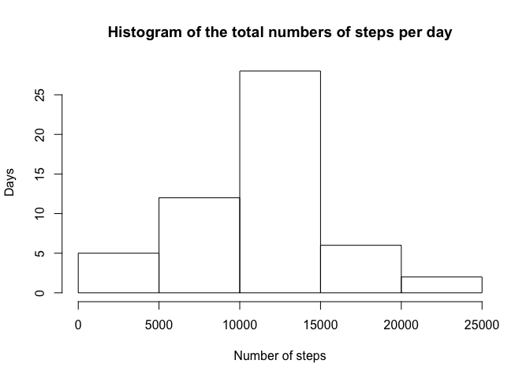
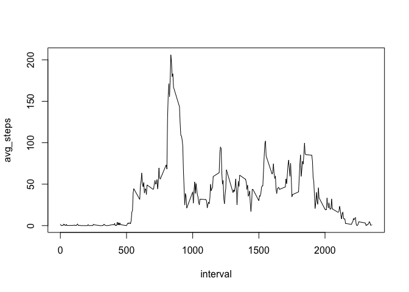
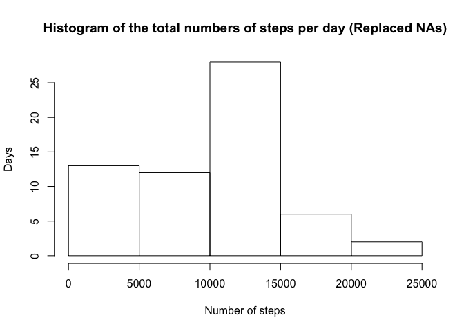
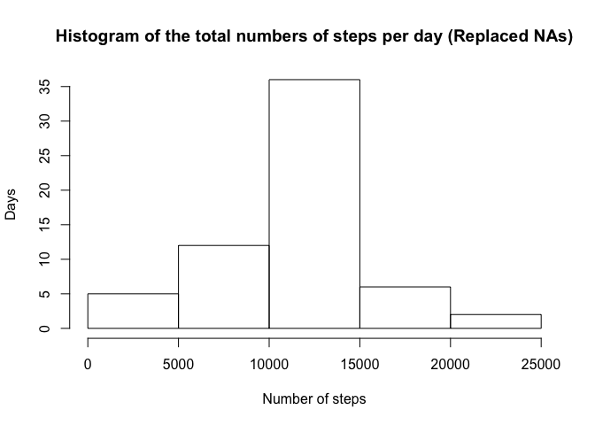
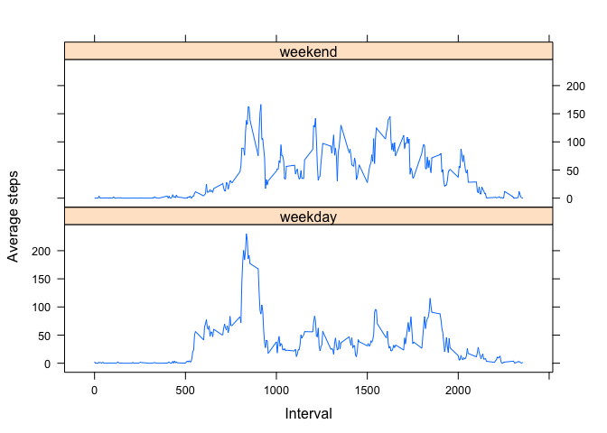

# Course Project 1

## Loading and preprocessing the data


```r
activity <- read.csv("activity.csv")
activity$date <- as.Date(activity$date)
```

## What is mean total number of steps taken per day?

```r
avg_steps_day <- activity %>% filter(!is.na(steps)) %>% group_by(date) %>% summarise(avg_steps = mean(steps))
median_steps_day <- activity %>% filter(!is.na(steps)) %>% group_by(date) %>% summarise(median_steps = median(steps))
total_steps_day <- activity %>% filter(!is.na(steps)) %>% group_by(date) %>% summarise(total_steps = sum(steps))
```


```r
mtable <- left_join(left_join(avg_steps_day, median_steps_day), total_steps_day)
```

```
## Joining, by = "date"
## Joining, by = "date"
```

```r
kable(mtable, caption="Average, Median and total numbers of steps per day")
```


Table: Average, Median and total numbers of steps per day

date           avg_steps   median_steps   total_steps
-----------  -----------  -------------  ------------
2012-10-02     0.4375000              0           126
2012-10-03    39.4166667              0         11352
2012-10-04    42.0694444              0         12116
2012-10-05    46.1597222              0         13294
2012-10-06    53.5416667              0         15420
2012-10-07    38.2465278              0         11015
2012-10-09    44.4826389              0         12811
2012-10-10    34.3750000              0          9900
2012-10-11    35.7777778              0         10304
2012-10-12    60.3541667              0         17382
2012-10-13    43.1458333              0         12426
2012-10-14    52.4236111              0         15098
2012-10-15    35.2048611              0         10139
2012-10-16    52.3750000              0         15084
2012-10-17    46.7083333              0         13452
2012-10-18    34.9166667              0         10056
2012-10-19    41.0729167              0         11829
2012-10-20    36.0937500              0         10395
2012-10-21    30.6284722              0          8821
2012-10-22    46.7361111              0         13460
2012-10-23    30.9652778              0          8918
2012-10-24    29.0104167              0          8355
2012-10-25     8.6527778              0          2492
2012-10-26    23.5347222              0          6778
2012-10-27    35.1354167              0         10119
2012-10-28    39.7847222              0         11458
2012-10-29    17.4236111              0          5018
2012-10-30    34.0937500              0          9819
2012-10-31    53.5208333              0         15414
2012-11-02    36.8055556              0         10600
2012-11-03    36.7048611              0         10571
2012-11-05    36.2465278              0         10439
2012-11-06    28.9375000              0          8334
2012-11-07    44.7326389              0         12883
2012-11-08    11.1770833              0          3219
2012-11-11    43.7777778              0         12608
2012-11-12    37.3784722              0         10765
2012-11-13    25.4722222              0          7336
2012-11-15     0.1423611              0            41
2012-11-16    18.8923611              0          5441
2012-11-17    49.7881944              0         14339
2012-11-18    52.4652778              0         15110
2012-11-19    30.6979167              0          8841
2012-11-20    15.5277778              0          4472
2012-11-21    44.3993056              0         12787
2012-11-22    70.9270833              0         20427
2012-11-23    73.5902778              0         21194
2012-11-24    50.2708333              0         14478
2012-11-25    41.0902778              0         11834
2012-11-26    38.7569444              0         11162
2012-11-27    47.3819444              0         13646
2012-11-28    35.3576389              0         10183
2012-11-29    24.4687500              0          7047


```r
hist(total_steps_day$total_steps, main = "Histogram of the total numbers of steps per day", xlab = "Number of steps", ylab = "Days")
```

<!-- -->

The distribution looks similar to a Normal distribution.

## What is the average daily activity pattern?

```r
avg_steps_across_days <- activity %>% filter(!is.na(steps)) %>% group_by(interval) %>% summarise(avg_steps = mean(steps))
plot(avg_steps_across_days, type = "l")
```

<!-- -->

It looks to start strong but decline as time goes on.

```r
max_step <- summarise(avg_steps_across_days, max_steps = max(avg_steps))
max_row <- filter(avg_steps_across_days, avg_steps == max_step$max_steps)
max_row$interval
```

```
## [1] 835
```

```r
max_row$avg_steps
```

```
## [1] 206.1698
```
The 835 interval contains the maximum number of steps (206.1698)

## Imputing missing values

```r
nas <- activity %>% filter(is.na(steps) | is.na(interval) | is.na(date))
count(nas)
```

```
## # A tibble: 1 x 1
##       n
##   <int>
## 1  2304
```
There is a total of 2304 rows with missing values.


```r
total <- data.frame()
dates <- unique(as.Date(activity$date))
for (day in dates) {
  # Filter by date
  filtered_by_date <- filter(activity, date == day)
  # Get replacement value
  na_replace_value <- filter(avg_steps_day, date == day)$avg_steps
  if(length(na_replace_value) == 0) na_replace_value <- 0
  # Replace value and collect into a total dataframe
  upgraded_activity <- mutate(filtered_by_date, steps = replace_na(steps, na_replace_value))
  total <- bind_rows(total, upgraded_activity)
}
```


```r
u_avg_steps_day <- total %>% filter(!is.na(steps)) %>% group_by(date) %>% summarise(avg_steps = mean(steps))
u_median_steps_day <- total %>% filter(!is.na(steps)) %>% group_by(date) %>% summarise(median_steps = median(steps))
u_total_steps_day <- total %>% filter(!is.na(steps)) %>% group_by(date) %>% summarise(total_steps = sum(steps))

hist(u_total_steps_day$total_steps, main = "Histogram of the total numbers of steps per day (Replaced NAs)", xlab = "Number of steps", ylab = "Days")
```

<!-- -->

The values differ from the first step. If we use the mean of steps per day as the replacement value and replace missing days mean with 0, we see that the distribution of values skews toward 0.


```r
total <- data.frame()
intervals <- unique(activity$interval)
for (inter in intervals) {
  # Filter by interval
  filtered_by_interval <- filter(activity, interval == inter)
  # Get replacement value
  na_replace_value <- filter(avg_steps_across_days, interval == inter)$avg_steps
  # Replace value and collect into a total dataframe
  upgraded_activity <- mutate(filtered_by_interval, steps = replace_na(steps, na_replace_value))
  total <- bind_rows(total, upgraded_activity)
}
```


```r
u_avg_steps_day <- total %>% filter(!is.na(steps)) %>% group_by(date) %>% summarise(avg_steps = mean(steps))
u_median_steps_day <- total %>% filter(!is.na(steps)) %>% group_by(date) %>% summarise(median_steps = median(steps))
u_total_steps_day <- total %>% filter(!is.na(steps)) %>% group_by(date) %>% summarise(total_steps = sum(steps))

hist(u_total_steps_day$total_steps, main = "Histogram of the total numbers of steps per day (Replaced NAs)", xlab = "Number of steps", ylab = "Days")
```

<!-- -->

If we use the median of steps per day as the replacement for missings value, we see that the distribution of values skews toward the center.


```r
mtable <- left_join(left_join(u_avg_steps_day, u_median_steps_day), u_total_steps_day)
```

```
## Joining, by = "date"
## Joining, by = "date"
```

```r
kable(mtable, caption="Average, Median and total numbers of steps per day with input data")
```


Table: Average, Median and total numbers of steps per day with input data

date           avg_steps   median_steps   total_steps
-----------  -----------  -------------  ------------
2012-10-01    37.3825996       34.11321      10766.19
2012-10-02     0.4375000        0.00000        126.00
2012-10-03    39.4166667        0.00000      11352.00
2012-10-04    42.0694444        0.00000      12116.00
2012-10-05    46.1597222        0.00000      13294.00
2012-10-06    53.5416667        0.00000      15420.00
2012-10-07    38.2465278        0.00000      11015.00
2012-10-08    37.3825996       34.11321      10766.19
2012-10-09    44.4826389        0.00000      12811.00
2012-10-10    34.3750000        0.00000       9900.00
2012-10-11    35.7777778        0.00000      10304.00
2012-10-12    60.3541667        0.00000      17382.00
2012-10-13    43.1458333        0.00000      12426.00
2012-10-14    52.4236111        0.00000      15098.00
2012-10-15    35.2048611        0.00000      10139.00
2012-10-16    52.3750000        0.00000      15084.00
2012-10-17    46.7083333        0.00000      13452.00
2012-10-18    34.9166667        0.00000      10056.00
2012-10-19    41.0729167        0.00000      11829.00
2012-10-20    36.0937500        0.00000      10395.00
2012-10-21    30.6284722        0.00000       8821.00
2012-10-22    46.7361111        0.00000      13460.00
2012-10-23    30.9652778        0.00000       8918.00
2012-10-24    29.0104167        0.00000       8355.00
2012-10-25     8.6527778        0.00000       2492.00
2012-10-26    23.5347222        0.00000       6778.00
2012-10-27    35.1354167        0.00000      10119.00
2012-10-28    39.7847222        0.00000      11458.00
2012-10-29    17.4236111        0.00000       5018.00
2012-10-30    34.0937500        0.00000       9819.00
2012-10-31    53.5208333        0.00000      15414.00
2012-11-01    37.3825996       34.11321      10766.19
2012-11-02    36.8055556        0.00000      10600.00
2012-11-03    36.7048611        0.00000      10571.00
2012-11-04    37.3825996       34.11321      10766.19
2012-11-05    36.2465278        0.00000      10439.00
2012-11-06    28.9375000        0.00000       8334.00
2012-11-07    44.7326389        0.00000      12883.00
2012-11-08    11.1770833        0.00000       3219.00
2012-11-09    37.3825996       34.11321      10766.19
2012-11-10    37.3825996       34.11321      10766.19
2012-11-11    43.7777778        0.00000      12608.00
2012-11-12    37.3784722        0.00000      10765.00
2012-11-13    25.4722222        0.00000       7336.00
2012-11-14    37.3825996       34.11321      10766.19
2012-11-15     0.1423611        0.00000         41.00
2012-11-16    18.8923611        0.00000       5441.00
2012-11-17    49.7881944        0.00000      14339.00
2012-11-18    52.4652778        0.00000      15110.00
2012-11-19    30.6979167        0.00000       8841.00
2012-11-20    15.5277778        0.00000       4472.00
2012-11-21    44.3993056        0.00000      12787.00
2012-11-22    70.9270833        0.00000      20427.00
2012-11-23    73.5902778        0.00000      21194.00
2012-11-24    50.2708333        0.00000      14478.00
2012-11-25    41.0902778        0.00000      11834.00
2012-11-26    38.7569444        0.00000      11162.00
2012-11-27    47.3819444        0.00000      13646.00
2012-11-28    35.3576389        0.00000      10183.00
2012-11-29    24.4687500        0.00000       7047.00
2012-11-30    37.3825996       34.11321      10766.19

## Are there differences in activity patterns between weekdays and weekends?

```r
daystagged <- total %>% mutate(daytype = case_when(weekdays(date) %in% c("Saturday", "Sunday") ~ "weekend", weekdays(date) %in% c("Monday", "Tuesday", "Wednesday", "Thursday", "Friday") ~ "weekday"))

weekend <- daystagged %>% filter(daytype == "weekend") %>% group_by(interval) %>% summarise(total_steps = mean(steps), daytype = "weekend")

weekday <- daystagged %>% filter(daytype == "weekday") %>% group_by(interval) %>% summarise(total_steps = mean(steps), daytype = "weekday")

final <- bind_rows(weekday, weekend)
xyplot(total_steps ~ interval|daytype, final,type='l', layout=c(1,2), xlab = "Interval" , ylab = "Average steps")
```

<!-- -->

It seems that at first the weekdays log more more steps on average, but as time goes on it seems to be overtaken by the weekend average steps. Is curious because there are 5 weekdays and only 2 weekend days.
